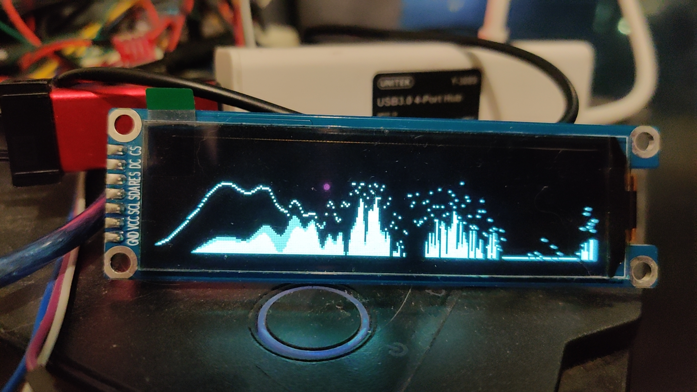

# STM32 Audio Visualizer
[Demo Video](https://youtu.be/XCwEq6FKENc)




## Hardware
- STM32F103C8
- SSD1362
    - 256x64 resolution

## Features
- Fast response
- Full LL library (No HAL)
- Full fixed point arithmetic
- 1024 point FFT
- Logarithmic scale
- DMA with Double buffering
    - No sample loss
- Interpolation methods:
    - Cubic spline 
    - Linear
    - Tabular

## Configurations
[application.h](Core/Inc/application.h)

Field | Description
| ----- | ----- |
```BAR_FALL_SPEED``` | Bar fall speed
```DOT_FALL_SPEED``` | Dot fall speed
```BAR_COLOR```      | Bar color 
```DOT_COLOR```      | Dot color
```DOT_TTL```        | Dot hold time
```FADE_SIZE```      | Gradient fade size
```LOG_SCALE```      | 0: Linear scale; 1: Log scale
```INTERP_METHOD```  | Interpolation method
Sampling frequency   | fs = 72MHz / (TIM3 counter period + 1)

## Hardware design considerations
- Spatially seperate analog and digital area
- Seperate regulator for digital and analog is REQUIRED
    - OLED module produces massive ripple on the digital rail
- Signal should be buffered using a RR(I)O Op-amp e.g. LMV32x and bias to VCC/2
    - Refer to **Typical Applications For Single Supply Operation** in [LM1875 datasheet](https://www.ti.com/lit/ds/symlink/lm1875.pdf)
